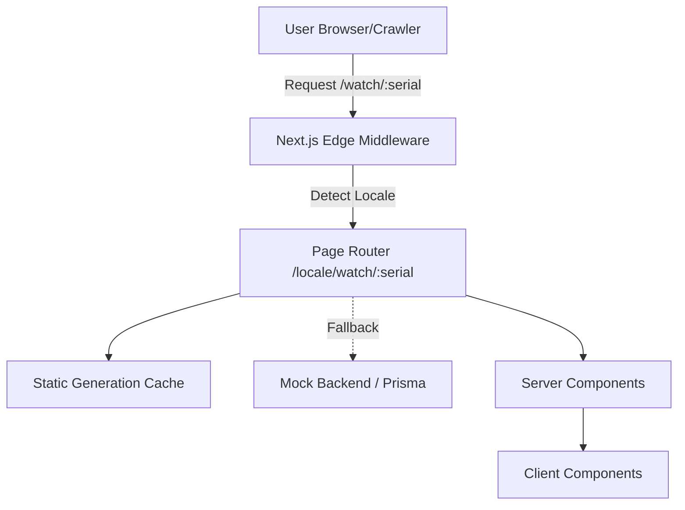

# AllChrono - Watch Passport Codebase Walkthrough

Welcome to the **AllChrono** codebase! This application serves as a premium, localized, and SEO-optimized provenance record for luxury watches.

## 1. Architecture Overview

The app is built on **Next.js 15 (App Router)**, **React 19**, **TypeScript**, and **Tailwind CSS v4**. It strongly adheres to the React Server Components (RSC) paradigm.

## 2. Component Strategy: Server vs. Client

To maximize performance, guarantee SEO indexability, and provide a resilient user experience, we aggressively split components.

### 🖥️ Server Components (RSC)
These components run entirely on the server. They ship zero JavaScript to the client, fetching data from our simulated backend and handling localization dictionaries.

| Component | Responsibility | Highlight |
|---|---|---|
| [`layout.tsx`](file:///Users/emranhossain/Programming/allchrono-task/src/app/[locale]/layout.tsx) | App Layout | Handles locale switching (`dir`, `lang`) and injects fonts. |
| `page.tsx` | Main Entry Point | Uses `generateStaticParams` to pre-build pages. |
| [`Timeline.tsx`](file:///Users/emranhossain/Programming/allchrono-task/src/components/passport/Timeline.tsx) | Provenance Timeline | Uses HTML `
` and `
` for JS-free expandability! |
| [`SpecsEmbed.tsx`](file:///Users/emranhossain/Programming/allchrono-task/src/components/passport/SpecsEmbed.tsx) | Watch Specifications | Handles data inconsistencies dynamically (e.g. string vs number for dimensions). |

> [!IMPORTANT]
> **The Zero-JS Requirement**
> The [`Timeline.tsx`](file:///Users/emranhossain/Programming/allchrono-task/src/components/passport/Timeline.tsx) is indexable at first paint. By leveraging native `
` elements, the accordion functions flawlessly even if the user has disabled JavaScript.

### Client Components
Interactive elements are kept to an absolute minimum and isolated to Client Components.

| Component | Interaction Focus |
|---|---|
| [`ImageMagnifier.tsx`](file:///Users/emranhossain/Programming/allchrono-task/src/components/passport/ImageMagnifier.tsx) | Tracks native mouse coordinates for a premium zoom effect. |
| [`ShareControls.tsx`](file:///Users/emranhossain/Programming/allchrono-task/src/components/passport/ShareControls.tsx) | Accesses `navigator.clipboard` and `window.print()` APIs. |
| [`CopyEmbedButton.tsx`](file:///Users/emranhossain/Programming/allchrono-task/src/components/passport/CopyEmbedButton.tsx) | UI state management for "Copied!" feedback. |

## 3. Localization & RTL (Right-to-Left) Mastery

We built RTL support without relying on clunky third-party libraries or transform hacks.

> [!TIP]
> **Tailwind v4 & CSS Logical Properties**
> By utilizing Tailwind combined with standard CSS logical properties (`margin-inline-start`, `border-s`), we natively mirror the layout for Arabic. It is performant, deeply integrated with the browser, and effortlessly maintains reading direction.

## 4. Data Fetching & Caching Strategy

The data fetching layer ([`src/lib/data.ts`](file:///Users/emranhossain/Programming/allchrono-task/src/lib/data.ts)) is designed with extreme scalability in mind.

1. **SSG (Static Site Generation):** Known watch passports are pre-generated at build time via `generateStaticParams`.
2. **ISR (Incremental Static Regeneration):** In production, new watches would be handled via ISR (e.g., `next: { revalidate: 3600 }`). Edge nodes serve 99% of requests, drastically reducing database load.
3. **Graceful Degradation:** String dates are custom parsed, but fallback to the raw string if the format is unexpected.

## 5. Roadmap & Next Steps

This initial release firmly establishes the "Day One" product. Scaling it involves building out the surrounding ecosystem:

- [ ] **Register & Auth Flow:** Enable collectors to claim and transfer passports.
- [ ] **Web3 Wallet Integration:** On-chain ownership proofs and signing transfers.
- [ ] **Advanced Analytics:** Telemetry to track embed badge distribution and social sharing impact.

---
