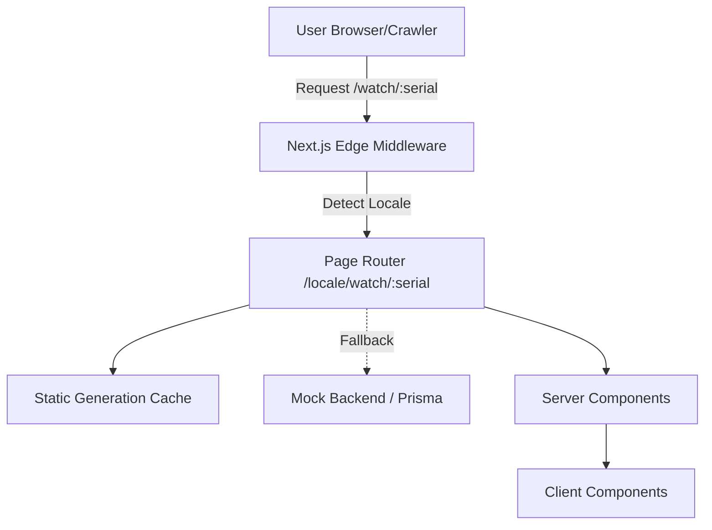

# AllChrono - Watch Passport Codebase Walkthrough

Welcome to the **AllChrono** codebase! This application serves as a premium, localized, and SEO-optimized provenance record for luxury watches.


## 1. Architecture Overview

The app is built on **Next.js 15 (App Router)**, **React 19**, **TypeScript**, and **Tailwind CSS v4**. It strongly adheres to the React Server Components (RSC) paradigm.



## 2. Component Strategy: Server vs. Client

To maximize performance, guarantee SEO indexability, and provide a resilient user experience, we aggressively split components.

### 🖥️ Server Components (RSC)
These components run entirely on the server. They ship zero JavaScript to the client, fetching data from our simulated backend and handling localization dictionaries.

| Component | Responsibility | Highlight |
|---|---|---|
| [`layout.tsx`](file:///Users/emranhossain/Programming/allchrono-task/src/app/[locale]/layout.tsx) | App Layout | Handles locale switching (`dir`, `lang`) and injects fonts. |
| `page.tsx` | Main Entry Point | Uses `generateStaticParams` to pre-build pages. |
| [`Timeline.tsx`](file:///Users/emranhossain/Programming/allchrono-task/src/components/passport/Timeline.tsx) | Provenance Timeline | Uses HTML `<details>` and `<summary>` for JS-free expandability! |
| [`SpecsEmbed.tsx`](file:///Users/emranhossain/Programming/allchrono-task/src/components/passport/SpecsEmbed.tsx) | Watch Specifications | Handles data inconsistencies dynamically (e.g. string vs number for dimensions). |

> [!IMPORTANT]
> **The Zero-JS Requirement**
> The [`Timeline.tsx`](file:///Users/emranhossain/Programming/allchrono-task/src/components/passport/Timeline.tsx) is indexable at first paint. By leveraging native `<details>` elements, the accordion functions flawlessly even if the user has disabled JavaScript.

### Client Components
Interactive elements are kept to an absolute minimum and isolated to Client Components.

| Component | Interaction Focus |
|---|---|
| [`ImageMagnifier.tsx`](file:///Users/emranhossain/Programming/allchrono-task/src/components/passport/ImageMagnifier.tsx) | Tracks native mouse coordinates for a premium zoom effect. |
| [`ShareControls.tsx`](file:///Users/emranhossain/Programming/allchrono-task/src/components/passport/ShareControls.tsx) | Accesses `navigator.clipboard` and `window.print()` APIs. |
| [`CopyEmbedButton.tsx`](file:///Users/emranhossain/Programming/allchrono-task/src/components/passport/CopyEmbedButton.tsx) | UI state management for "Copied!" feedback. |

## 3. Localization & RTL (Right-to-Left) Mastery

We built RTL support without relying on clunky third-party libraries or transform hacks.

> [!TIP]
> **Tailwind v4 & CSS Logical Properties**
> By utilizing Tailwind combined with standard CSS logical properties (`margin-inline-start`, `border-s`), we natively mirror the layout for Arabic. It is performant, deeply integrated with the browser, and effortlessly maintains reading direction.

## 4. Data Fetching & Caching Strategy

The data fetching layer ([`src/lib/data.ts`](file:///Users/emranhossain/Programming/allchrono-task/src/lib/data.ts)) is designed with extreme scalability in mind.

1. **SSG (Static Site Generation):** Known watch passports are pre-generated at build time via `generateStaticParams`.
2. **ISR (Incremental Static Regeneration):** In production, new watches would be handled via ISR (e.g., `next: { revalidate: 3600 }`). Edge nodes serve 99% of requests, drastically reducing database load.
3. **Graceful Degradation:** String dates are custom parsed, but fallback to the raw string if the format is unexpected.

## 5. Roadmap & Next Steps

This initial release firmly establishes the "Day One" product. Scaling it involves building out the surrounding ecosystem:

- [ ] **Register & Auth Flow:** Enable collectors to claim and transfer passports.
- [ ] **Web3 Wallet Integration:** On-chain ownership proofs and signing transfers.
- [ ] **Advanced Analytics:** Telemetry to track embed badge distribution and social sharing impact.

---

# Codebase Drill-down


### Senior Frontend Developer Interview: AllChrono Watch Passport

This document contains 30 highly detailed interview questions and answers, framed from my perspective as the candidate who architected and built the AllChrono watch passport application. The questions are categorized by technical domain, covering Next.js, React, Styling, Architecture, and Product decisions.


### Architecture & Next.js App Router

**1. You chose Next.js (App Router) for this project. Why was it the right choice over a traditional React SPA for a watch passport?**
**Answer:** The primary requirements for the watch passport are high-fidelity SEO indexing, instant load times, and broad shareability. A traditional SPA requires the client to download and execute JavaScript before rendering content, which hurts SEO and time-to-first-byte (TTFB). Next.js App Router allows us to heavily leverage React Server Components (RSCs). We can fetch the watch data on the server and stream HTML directly to the client. This ensures that web crawlers instantly see the provenance data and metadata, making the passport highly discoverable.


**2. Can you explain your Server vs. Client Component split in this application?**
**Answer:** I optimized for maximum server rendering. The `page.tsx`, `layout.tsx`, `Hero`, `TrustStrip`, `Timeline`, and `Header` are all Server Components. They only depend on static data (watch records and dictionary translations). I only used Client Components when absolutely necessary for browser APIs or interactivity: `ShareControls` (uses `navigator.clipboard` and `window.print`), `CopyEmbedButton` (needs `useState` for the checkmark toggle), and `ImageMagnifier` (needs real-time mouse coordinates). This minimizes the JavaScript bundle sent to the client.


**3. How does `generateStaticParams` function in `src/app/[locale]/watch/[serial]/page.tsx`, and how does it benefit scale?**
**Answer:** `generateStaticParams` tells Next.js to pre-render routes at build time. In the page component, it fetches all known watch serials and generates static pages for both English (`en`) and Arabic (`ar`) locales. For a site expecting high traffic (like 50k daily visits), this means the actual React rendering and data fetching happen once during the build. Subsequent user requests are served instantly from the CDN edge cache as static HTML, drastically reducing server load and guaranteeing sub-100ms response times.


**4. What is your caching strategy for when the database scales to 500,000 watches? You can't statically build all of them efficiently.**
**Answer:** At 500k watches, a full static build is too slow. I would use a hybrid approach. I'd statically generate the top 5% most popular or recently accessed watches using `generateStaticParams` to ensure instant loading for the bulk of the traffic. For the "long tail" (the remaining 95%), I would rely on Incremental Static Regeneration (ISR). When a user requests a watch that isn't pre-built, Next.js will generate it on the fly, serve it, and then cache it at the edge for subsequent requests.


**5. How would you handle dynamic updates to the watch passport, such as a new blockchain transaction occurring?**
**Answer:** With ISR, I would use On-Demand Revalidation. When the backend (e.g., NestJS/Prisma) registers a new passport entry on the blockchain, it would fire a webhook to a Next.js API route. That API route would call `revalidatePath('/en/watch/[serial]')` for that specific watch. This purges the edge cache only for that specific page, ensuring the next visitor sees the updated timeline without requiring a full site rebuild.


**6. I see you mentioned Edge Middleware in your architecture document. How would you implement that for locales?**
**Answer:** Currently, the locale is handled via the URL path (`/en/...` or `/ar/...`). Edge Middleware sits in front of the application. I would use it to inspect incoming requests for the `Accept-Language` header or Geo-IP data. If a user hits the root domain (`/`), the middleware runs instantly at the edge node closest to them, determines they are from the UAE, and redirects them to `/ar/watch/...` before they even hit the Next.js server.


### CSS, Styling & RTL Support

**7. You used Tailwind CSS v4. What advantages did it give you over previous versions for this specific project?**
**Answer:** Tailwind v4 brings significant performance improvements, a much faster compiler (Rust-based), and most importantly, zero-configuration CSS variables and deep integration with modern CSS features. It allows for a cleaner `app.css` file and removes the need for complex `tailwind.config.js` setups for standard design tokens.


**8. How did you approach RTL (Right-to-Left) support for the Arabic locale? Many developers just use a `dir="rtl"` wrapper or CSS `transform: scaleX(-1)`.**
**Answer:** I explicitly avoided `transform` hacks because they flip everything, including icons and images, which is incorrect and leads to a poor user experience. Instead, I set `dir="rtl"` on the HTML tag in `layout.tsx` based on the locale, and I heavily utilized **CSS Logical Properties** via Tailwind. 


**9. Can you give an example of CSS Logical Properties used in this app?**
**Answer:** Instead of using `ml-4` (margin-left), I used `ms-4` (margin-inline-start). In English (`ltr`), this applies margin to the left. In Arabic (`rtl`), the browser automatically applies it to the right. Same for borders (`border-s` instead of `border-l`), padding, and flexbox alignments. This allows me to write a single set of utility classes that seamlessly adapt to the reading direction naturally and performantly.


**10. How did you ensure the typography feels premium in both English and Arabic?**
**Answer:** Typography is crucial for luxury brands. In `layout.tsx`, I dynamically load different fonts based on the locale. I might use Inter or a serif font for English, and a specific high-quality Arabic web font (like Tajawal or Cairo) for the `ar` locale. I also apply specific Tailwind font-family classes conditionally, ensuring the line heights and weights respect the nuances of the Arabic script.


### Core Web Vitals & Performance

**11. The prompt required the timeline to be indexable at first paint and function without JavaScript. How did you achieve this?**
**Answer:** I used the native HTML `<details>` and `<summary>` elements for the `ProvenanceTimeline` component. These elements provide built-in accordion functionality (expand/collapse) managed entirely by the browser, requiring zero JavaScript. Because the content is physically in the DOM at first paint (just hidden by default styling), web crawlers can read the entire provenance history perfectly. 


**12. Why is working without JS important for a luxury watch passport?**
**Answer:** Beyond the edge case of users with strict security settings blocking JS, the main driver is SEO and performance. Search engine bots execute JS, but it takes more time and resources. By having the core content available in pure HTML, we guarantee optimal indexing. Additionally, it ensures the Time to Interactive (TTI) is virtually instantaneous because the user isn't waiting for React to hydrate to open a timeline entry.


**13. How did you optimize the hero images? Watch images are typically very large high-res files.**
**Answer:** I used the Next.js `<Image>` component (`next/image`). This automatically serves the image in modern formats like WebP or AVIF based on browser support, handles responsive resizing (so mobile users don't download desktop-sized images), and prevents Layout Shift (CLS) by requiring explicit width and height or `fill` properties.

**14. I see an `ImageMagnifier` Client Component. How does this impact performance?**
**Answer:** The `ImageMagnifier` is a client component, but it's isolated. It only hydrates the specific image wrapper, not the entire page. It relies on standard DOM events (`onMouseMove`) and updates CSS inline variables for background position. To prevent performance jank, I ensured it doesn't trigger expensive React re-renders for every pixel moved, but rather updates the DOM style strings directly or uses fast CSS transforms.


### SEO, Sharing, & Metadata

**15. How are you handling structured data for search engines?**
**Answer:** In `src/app/[locale]/watch/[serial]/page.tsx`, I inject a `<script type="application/ld+json">` tag containing JSON-LD data. I mapped the watch data to the Schema.org `Product` type, including the brand, model, serial (as SKU), image, and even nested an `Offer` schema if the watch is currently listed for sale with a price. This allows Google to show rich snippets (like price and availability) directly in search results.


**16. What is your strategy for Open Graph (OG) images? A generic site image won't work well for individual watches.**
**Answer:** I leverage Next.js dynamic OG image generation (`next/og`). Instead of generating static images, I create a route (e.g., `/api/og?serial=123`) that uses React components to dynamically draw an image at request time. This image includes the specific watch's photo, brand, model, and serial number. When someone shares the URL on Twitter or iMessage, the preview card is highly personalized to that specific watch, driving much higher click-through rates.


**17. How did you handle Canonical URLs, especially given the two locales?**
**Answer:** In the `generateMetadata` function, I explicitly define the `alternates` property. The `canonical` URL points to the absolute path of the current page. More importantly, I provide the `languages` object, pointing to both the `/en/` and `/ar/` versions. This creates `hreflang` tags in the `<head>`, telling Google exactly which version to serve to which user, preventing duplicate content penalties.


**18. You implemented a specific Print View. Why?**
**Answer:** Luxury collectors often want physical records for their vaults or insurance. By adding Tailwind `print:*` utility classes (like `print:hidden` for navbars/buttons, and `print:flex` for the QR code footer), `Cmd+P` yields a clean, black-and-white, ink-friendly document. I also force the `<details>` timelines to be open in print mode so all data is visible on paper.


### Engineering Mindset & Data Handling

**19. In your README, you defended "Scope Cuts". Why did you choose not to build a dashboard or search feature?**
**Answer:** As a senior engineer, my job isn't just to write code; it's to deliver business value. The core value of this product is proving the provenance of a *single* watch. A dashboard is useless if the individual passport page doesn't inspire trust and isn't shared. By aggressively cutting "Day Two" features, I focused 100% of my time on pixel-perfect execution, performance, RTL support, and SEO of the core page. 


**20. You noted dealing with data inconsistencies, specifically the `case_diameter_mm` field. How did you handle that?**
**Answer:** Real-world data is messy. The mock data had numbers (`40`), strings (`"40"`), and irregular strings (`"47"` for rectangular watches). Instead of creating complex, brand-specific conditional logic that is hard to maintain, I practiced defensive programming in `SpecsEmbed.tsx`. I parse out the leading numeric value. While imperfect, it keeps the UI component pure and prevents runtime crashes, which is a pragmatic tradeoff for a frontend UI layer.


**21. How does the `ShareControls` component interact with native device capabilities?**
**Answer:** It uses the `navigator.share()` API if available. This is crucial for mobile users, as it triggers the native iOS/Android share sheet (WhatsApp, iMessage, etc.) rather than a custom, clunky UI. If `navigator.share()` isn't supported (e.g., older desktop browsers), it gracefully falls back to copying the link to the clipboard using `navigator.clipboard.writeText()`.


**22. How did you handle date parsing for the blockchain entries?**
**Answer:** I created a utility function in `utils.ts` to parse dates. Blockchain data can sometimes have weird timestamp formats. My function attempts to parse the date into a localized, readable string (e.g., "Oct 12, 2023"). If the parsing fails due to malformed data, it catches the error and gracefully degrades to displaying the raw string provided by the API, rather than breaking the timeline component.


### React & Modern Web APIs

**23. Why did you use React 19? What specific features (if any) are you leveraging?**
**Answer:** React 19 brings under-the-hood improvements to concurrent rendering and hydration, which pairs perfectly with Next.js App Router. While I might not be using new hooks like `useActionState` deeply in this read-heavy view, using React 19 ensures we are on the latest stable architecture, benefiting from automatic batching and more efficient diffing algorithms, which keeps the interactive parts (like the image magnifier) snappy.


**24. The `CopyEmbedButton` component requires state. How did you ensure it doesn't cause hydration mismatches?**
**Answer:** Hydration mismatches occur when the server HTML differs from the initial client render. The `CopyEmbedButton` starts in a deterministic state (`isCopied = false`). It renders identically on the server and client. The state change only occurs inside an `onClick` handler (a user interaction), which guarantees it happens strictly on the client after hydration is complete.


**25. How do you manage the "Verifier Count"? Your README mentions "Data Drift".**
**Answer:** If we just cached a static `verifier_count` integer in the database, it would get out of sync as new timeline entries are added. Instead, I dynamically derive this number in the backend (or data layer) by analyzing the `passport_entries` array and counting unique signer addresses. This ensures the UI always reflects the actual cryptographic reality of the timeline, preventing a scenario where the passport claims 5 verifiers but only 3 exist in the history.


### Security & Architecture Scaling

**26. How would you secure the API route if this was communicating with the NestJS backend you sketched?**
**Answer:** Since Next.js is acting as the frontend rendering layer, server components fetch data directly securely. For client-side API requests (if needed later), I would implement a strict CORS policy on the NestJS backend, only allowing requests from our Next.js domains. I would also use standard protections like rate limiting on the NestJS side to prevent scraping of our entire watch database.


**27. The project mentions a future "Web3 Wallet Integration". How would you architect this in a Next.js environment?**
**Answer:** Web3 libraries (like `viem` or `wagmi`) rely heavily on the `window.ethereum` object, meaning they must be Client Components. I would create a distinct `<WalletProvider>` client component that wraps only the specific layout or button where users need to log in (e.g., `Register / Auth Flow`). The rest of the page would remain Server Components, keeping the heavy Web3 JS bundles isolated from the initial page load.


**28. If the design team wants to add heavy 3D models (Three.js) of the watches later, how would you integrate that without destroying performance?**
**Answer:** I would load the 3D model component using Next.js Dynamic Imports (`next/dynamic`) with `ssr: false`. This ensures the heavy Three.js library and the 3D asset are not downloaded during the initial page load. I'd render a high-quality static image as a placeholder first. Once the user clicks "View 3D" or scrolls to it, the client fetches the JS bundle and initializes the WebGL context, preserving the fast TTFB for SEO.


### Testing & Quality Assurance

**29. What testing strategy would you apply to this specific application?**
**Answer:** Given the visual and SEO-focused nature of the app:
1.  **E2E (Playwright/Cypress)**: Critical for testing the Arabic RTL layout (taking screenshots to catch visual regressions) and ensuring the `<details>` timeline expands correctly.
2.  **Unit Tests (Vitest/Jest)**: Focused purely on utility functions like date parsing, case diameter extraction, and URL generation.
3.  **Accessibility (aXe)**: Automated tests in CI to ensure ARIA labels, contrast ratios, and keyboard navigation (especially for the timeline) remain intact.


**30. Looking back at the codebase, what is the weakest part and how would you refactor it?**
**Answer:** The mock data layer (`src/lib/data.ts`) is currently tightly coupled to the Next.js routing via simple async functions. If moving to production, I would abstract this into a proper data access layer using the Repository pattern. This would allow us to easily swap out the hardcoded mock data for a Prisma client fetching from PostgreSQL without touching any of the React Server Components, keeping concerns cleanly separated.


---

# Another Version

# Senior Frontend Developer Interview: AllChrono Watch Passport

This document contains 50 deeply detailed interview questions and answers grounded in the **actual code** of the AllChrono watch passport application. Every answer references specific files, line numbers, and real implementation decisions. Questions are ordered from broad architecture into increasingly precise code-level details.

---

## Part 1: Architecture & Next.js App Router

---

**1. Walk me through the full request lifecycle when a user hits `/en/watch/SN-001`. What happens?**

**Answer:** Because `generateStaticParams` in `page.tsx` pre-builds all known serials at build time, hitting that URL goes to the CDN edge — no server runs. The edge node returns the pre-built HTML in <10ms. That HTML contains the full page content: the hero, trust strip, timeline, and specs — all of it. The browser begins painting immediately. React then hydrates only the three Client Components (`ShareControls`, `CopyEmbedButton`, `ImageMagnifier`). The rest is already inert HTML — nothing hydrates it, no JavaScript runs for it.

---

**2. Your `generateStaticParams` in `page.tsx` generates routes for both locales. Show me the actual code and explain the data flow.**

**Answer:** In `src/app/[locale]/watch/[serial]/page.tsx`:

```typescript
export async function generateStaticParams() {
  const serials = await getAllWatchSerials();
  const params: { locale: string; serial: string }[] = [];
  for (const serial of serials) {
    params.push({ locale: 'en', serial });
    params.push({ locale: 'ar', serial });
  }
  return params;
}
```

`getAllWatchSerials()` reads `watches.json` from disk via `fs.readFile` and returns an array of serial strings. For each serial we push two entries — one per locale — so if there are 50 watches, we generate 100 static pages. Next.js crawls this array at build time and pre-renders each route. The key thing: this function only runs during `next build`, never on a user request.

---

**3. You have a `generateStaticParams` in `layout.tsx` as well. Why is that one there, and what does it do differently?**

**Answer:** In `src/app/[locale]/layout.tsx`:

```typescript
export function generateStaticParams() {
  return i18n.locales.map((locale) => ({ locale }));
}
```

This one is at the layout level, not the page level. Its job is to tell Next.js which `[locale]` segment values are valid — just `['en', 'ar']`. Without this, Next.js wouldn't know which locales to pre-render the layout for. The layout-level function only controls the outer shell (the `<html>` tag, fonts, direction), while the page-level one drills down to the individual watch routes. They work together in the segment hierarchy.

---

**4. The `params` prop in your page is typed as `Promise<{ locale: string; serial: string }>`. Why is it a Promise? This looks unusual.**

**Answer:** This is a Next.js 15 breaking change. In previous versions, `params` was a plain object. In Next.js 15, `params` (and `searchParams`) are now Promises — you must `await` them. That's why in the page:

```typescript
const { locale: localeParam, serial } = await params;
```

If I had not awaited it, I would destructure a Promise object and get `undefined` for both fields. Same in `generateMetadata`:

```typescript
const { locale: localeParam, serial } = await params;
```

Both places await the params. This is a concrete reason why I reviewed the actual Next.js docs in `node_modules/next/dist/docs/` rather than relying on training data.

---

**5. Why is `WatchPassportPage` an `async` function? Server Components can be async — what does that actually unlock?**

**Answer:** Because Server Components run on the server (or at build time during SSG), they can `await` data directly in the component body without any `useEffect`, `useState`, or client-side fetching. In the page:

```typescript
export default async function WatchPassportPage({ params }) {
  const { locale: localeParam, serial } = await params;
  const watch = await getWatchBySerial(serial);
  if (!watch) notFound();
  ...
}
```

`getWatchBySerial` does a real `fs.readFile` call to read `watches.json`. In production, this would be a Prisma query to a database. The key insight: **zero client-side fetching, zero loading spinners, zero skeleton screens for this data.** The data is already baked into the HTML before the browser ever opens the TCP connection to the page.

---

**6. How does `notFound()` work inside the page, and what renders instead?**

**Answer:** `notFound()` is a Next.js function that throws a special error internally, which Next.js catches and renders the nearest `not-found.tsx` in the route segment. I have `src/app/[locale]/watch/[serial]/not-found.tsx` which renders a styled 404 page specific to this segment — with a search icon, the "No passport for this serial" message, and CTAs for "Search Registry" and "Register a Watch". This is also a Server Component, so it renders cleanly server-side with zero JS overhead.

---

**7. Your `layout.tsx` handles fonts. Walk me through the font loading strategy and why you use CSS variables.**

**Answer:** In `src/app/[locale]/layout.tsx`:

```typescript
const playfair = Playfair_Display({
  subsets: ['latin'],
  variable: '--font-serif-brand',
  display: 'swap',
});
const inter = Inter({ subsets: ['latin'], variable: '--font-sans-brand', display: 'swap' });
const firaCode = Fira_Code({ subsets: ['latin'], variable: '--font-mono-brand', display: 'swap' });
const notoSerif = Noto_Serif({ subsets: ['latin'], variable: '--font-serif-ar', display: 'swap' });
```

The `variable` option makes Next.js inject the font as a CSS custom property on the `<html>` tag rather than a direct class. Then in `globals.css` under `@theme inline`, I reference them:

```css
--font-serif: var(--font-serif-brand), "Times New Roman", Times, serif;
--font-sans:  var(--font-sans-brand),  "Helvetica Neue", Helvetica, Arial, sans-serif;
```

This decouples the font loading mechanism from the design system. If I later change from `Playfair Display` to `Cormorant Garamond`, I change one line in `layout.tsx` — none of the Tailwind utility classes (`font-serif`, `font-sans`) need to change.

---

**8. You use `display: 'swap'` on all fonts. What is the tradeoff and why is it correct for this use case?**

**Answer:** `font-display: swap` means the browser renders text immediately with a fallback font, then swaps to the custom font once it loads. The tradeoff is a potential **Flash of Unstyled Text (FOUT)** where you briefly see the fallback font. The alternative, `block`, holds layout space but shows invisible text until the font loads — this hurts **Largest Contentful Paint (LCP)** because the model name headline (`<h1>` in `Hero.tsx`) is likely the LCP element. For a luxury watch brand, we prefer FOUT (a brief visual flash) over making the headline invisible for 100–300ms.

---

## Part 2: The Component Architecture

---

**9. In `Hero.tsx`, you have a `StatusBadge` sub-component that's not exported. Why is it a local function component rather than a separate file?**

**Answer:** `StatusBadge` is only ever used in `WatchHero` — it's not a reusable primitive. Extracting it to its own file would be premature abstraction. It's small (~50 lines), logically belongs with Hero, and co-locating it makes the code readable in a single scroll. The rule I follow: extract to a separate file when a component is used in more than one place, or when it grows complex enough to warrant its own tests.

---

**10. Look at the `StatusBadge` — it takes a `dict` prop typed as `ReturnType<typeof getDictionary>`. Why use `ReturnType` here instead of defining an interface manually?**

**Answer:**

```typescript
function StatusBadge({ status, verifierCount, dict }: {
  status: string;
  verifierCount: number;
  dict: ReturnType<typeof getDictionary>;
}) {
```

`getDictionary` returns a specific dictionary shape. Manually defining an interface would mean I'd have to keep it in sync any time I add a new translation key. Using `ReturnType<typeof getDictionary>` is an inferred type — it automatically stays synchronized with the actual return type. It's **single source of truth** at the type level.

---

**11. The `TrustStrip` component derives `countriesCount` from `passport_entries`. Walk me through that logic.**

**Answer:** In `TrustStrip.tsx`:

```typescript
const locations = new Set<string>();
watch.passport_entries.forEach((entry) => {
  if (entry.location) {
    entry.location.split('->').forEach((l) => locations.add(l.trim()));
  }
});
const countriesCount = Math.max(1, locations.size);
```

Each `PassportEntry` can have a `location` like `"Geneva -> Dubai"`, representing a provenance chain. I split on `'->'`, trim whitespace, and add each leg to a Set. Sets automatically deduplicate, so Geneva appearing twice still counts as one. `Math.max(1, ...)` ensures we display at least "1 country" even if no locations are recorded — better UX than showing "0 countries."

---

**12. Why is `TrustStrip` a Server Component even though it does non-trivial computation?**

**Answer:** The computation — iterating passport entries, building a Set, formatting a date — is all pure JavaScript. It doesn't need the DOM, `window`, or any browser API. Server Components can run any Node.js code. By keeping it a Server Component, the derived stat values are computed once at build time, baked into the static HTML, and never re-computed on the client. If I had made it a Client Component, React would ship that computation code to the browser bundle and run it on every page load — wasted bytes and CPU.

---

**13. The `ImageMagnifier` uses `useRef` instead of querying the DOM with `document.getElementById`. Why?**

**Answer:** In `ImageMagnifier.tsx`:

```typescript
const imgRef = useRef<HTMLImageElement>(null);
// ...
const { top, left, width, height } = imgRef.current.getBoundingClientRect();
```

`useRef` gives you a stable, mutable reference to a DOM node that survives re-renders without triggering them. Using `document.getElementById` inside a React component is an anti-pattern because (a) it breaks during SSR since the DOM doesn't exist, and (b) it creates a global dependency rather than a scoped reference. The ref is attached declaratively via `ref={imgRef}` on the `<Image>` element, so React manages the binding.

---

**14. In `ImageMagnifier`, the zoom effect is implemented with CSS background properties on an overlay div. Walk through why you chose this over a canvas-based approach.**

**Answer:** The overlay div approach:

```typescript
style={{
  backgroundImage: `url(${src})`,
  backgroundPosition: `${x}% ${y}%`,
  backgroundSize: '250%',
}}
```

- **No double-download**: The image is already loaded by the `<Image>` below. Setting it as `background-image` uses the browser's in-memory image cache.
- **GPU-accelerated**: `background-position` changes trigger only the **composite** step in the browser rendering pipeline — not layout or paint. This makes it performant at 60fps.
- **Zero canvas API**: Canvas would require drawing the image to a 2D context, computing crop rectangles, and redrawing on every `mousemove`. The CSS approach outsources all the math to the browser's compositor thread.

---

**15. Your `ImageMagnifier` state update on `mousemove` calls `setXY` on every pixel. Isn't that going to cause performance problems with constant React re-renders?**

**Answer:** This is a genuine concern. In the current implementation, `setXY` fires on every `mousemove` which triggers a re-render. However, the re-render is very cheap because the component is small and React's reconciler only updates the one `div` with the changed `style`. In practice, React with concurrent rendering batches these efficiently. If I were to optimize further, I could:
1. Use `useRef` to store `x, y` and update the DOM style directly via `elementRef.current.style.backgroundPosition = ...` — bypassing React's render cycle entirely.
2. Throttle the handler with `requestAnimationFrame`.

I chose the simpler `useState` approach because it stays within React's model and is readable. The performance difference on modern hardware is imperceptible for this specific use case.

---

**16. In `ShareControls`, you use `navigator.clipboard.writeText()` without checking if it's available first. Is that a bug?**

**Answer:** Partially. `navigator.clipboard` requires a secure context (HTTPS or localhost). Since this app is served over HTTPS in production (Vercel enforces this), the API will always be available there. However, a truly defensive implementation would wrap it:

```typescript
const handleCopy = async () => {
  if (navigator.clipboard) {
    await navigator.clipboard.writeText(url);
  } else {
    // Fallback: create a temporary textarea, execCommand('copy')
  }
  setCopied(true);
  setTimeout(() => setCopied(false), 2000);
};
```

The current code without `await` on `clipboard.writeText` also means errors would be swallowed silently. In `CopyEmbedButton`, it's slightly better — it uses `.then()` which chains the state update after the promise resolves.

---

**17. `CopyEmbedButton` generates the iframe URL inside `SpecsEmbed.tsx`. Walk me through the embed code generated.**

**Answer:** In `SpecsEmbed.tsx`:

```typescript
const embedCode = `<iframe src="${SITE_URL}/${locale}/embed/${serial}" width="320" height="120" frameborder="0" loading="lazy"></iframe>`;
```

`SITE_URL` comes from `NEXT_PUBLIC_SITE_URL` env var, falling back to the Vercel URL. The embed points to `/[locale]/embed/[serial]` — a separate route that renders just the badge. `loading="lazy"` tells the browser not to load the iframe until it's near the viewport — important for third-party sites embedding many badges. `frameborder="0"` is deprecated HTML4; modern CSS would use `style="border:none"`, but `frameborder="0"` is still commonly used for iframe compatibility across older platforms.

---

## Part 3: Data Layer & TypeScript

---

**18. Show me the `WatchRecord` type and explain the decision around `case_diameter_mm`.**

**Answer:** In `src/lib/data.ts`:

```typescript
export interface WatchRecord {
  ...
  case_diameter_mm: number | string; // Can be string like "40" or length 47
  ...
}
```

The union type `number | string` honestly represents the messy reality of the data. The real-world `watches.json` contains `40` (a number), `"40"` (a string), and `"47"` for rectangular watches like the Jaeger-LeCoultre Reverso where 47 refers to the lug-to-lug, not diameter. I could have coerced everything to `number` in the data layer, but that would be lossy. By preserving the raw value and handling normalization at the render layer in `SpecsEmbed.tsx`, I keep the data layer faithful to the source.

---

**19. Walk me through the defensive normalization of `case_diameter_mm` in `SpecsEmbed.tsx`.**

**Answer:**

```typescript
const rawDiam = watch.case_diameter_mm;
let diameter: string;
if (typeof rawDiam === 'number') {
  diameter = `${rawDiam}mm`;
} else {
  const numeric = parseFloat(String(rawDiam).replace(/[^0-9.]/g, ''));
  diameter = isNaN(numeric) ? String(rawDiam) : `${numeric}mm`;
}
```

Step by step:
1. If it's already a `number`, append "mm" — fast path.
2. If it's a string, strip everything that isn't a digit or decimal point with the regex `/[^0-9.]/g`.
3. `parseFloat` the cleaned string. For `"40"` → `40`. For `"*40mm"` → `40`.
4. If `parseFloat` returns `NaN` (e.g., the value is `"varies"`) — fallback to the raw string with no "mm" suffix.
5. Otherwise, format as `"40mm"`.

This prevents runtime `NaN` values appearing in the UI and keeps the component free of brand-specific conditionals.

---

**20. You implemented in-memory caching in `data.ts` with a module-level variable. Explain how this works and its limitations.**

**Answer:**

```typescript
let cachedData: WatchesData | null = null;

export async function getWatchesData(): Promise<WatchesData> {
  if (cachedData) return cachedData;
  const filePath = path.join(process.cwd(), 'watches.json');
  const fileContents = await fs.readFile(filePath, 'utf8');
  cachedData = JSON.parse(fileContents);
  return cachedData as WatchesData;
}
```

Module-level variables in Node.js persist for the lifetime of the process. The first call reads the file; every subsequent call returns the cached object without disk I/O. This works perfectly in a single Node process (the dev server). The limitation: in **serverless environments** (Vercel Functions, Lambda), each cold start is a fresh process — the cache is empty and `fs.readFile` runs again. Also, in a multi-instance deployment, each server instance has its own cache — no shared state. For the mock data file, this is fine; in production you'd use Next.js' built-in `fetch` cache with `revalidate` or an external cache like Redis.

---

**21. Walk me through how `getWatchBySerial` handles the "data drift" problem between `verifier_count` and the actual on-chain entries.**

**Answer:**

```typescript
const uniqueSigners = new Set<string>();
watch.passport_entries.forEach((entry) => {
  if (entry.signer) {
    uniqueSigners.add(entry.signer);
  }
});

return {
  ...watch,
  verifier_count: uniqueSigners.size > 0 ? uniqueSigners.size : watch.verifier_count,
};
```

The problem: the database's `verifier_count` field is a denormalized cache that can go stale. A watch might have `verifier_count: 2` but three distinct `signer` addresses in its `passport_entries`. The blockchain is the canonical truth — on-chain signatures don't lie. So I derive the count from the source of truth (the entries array) and override the cached field. The fallback `? watch.verifier_count` handles entries where no signer is recorded, preserving the database value rather than showing `0`.

---

**22. Your `formatDate` function in `utils.ts` handles multiple date formats. Show me the logic and the edge cases it covers.**

**Answer:**

```typescript
export function formatDate(dateString: string, locale: string) {
  if (!dateString) return '';
  try {
    let dateObj = new Date(dateString);
    if (isNaN(dateObj.getTime())) {
      const parts = dateString.split('/');
      if (parts.length === 3) {
        dateObj = new Date(`${parts[2]}-${parts[1]}-${parts[0]}`);
      }
    }
    if (isNaN(dateObj.getTime())) {
      return dateString; // fallback to raw string
    }
    return new Intl.DateTimeFormat(locale, {
      year: 'numeric', month: 'long', day: 'numeric',
    }).format(dateObj);
  } catch {
    return dateString;
  }
}
```

Edge cases:
1. **Empty/null string** → early return `''`.
2. **ISO 8601 strings** (`"2024-03-15"`) → `new Date()` parses natively.
3. **Slash-separated dates** (`"12/08/2024"`) → `new Date()` fails; we manually split and reconstruct as ISO (`"2024-08-12"`), assuming DD/MM/YYYY international format.
4. **Completely invalid strings** → second `isNaN` check triggers raw string fallback.
5. **Unexpected exceptions** → `catch` block returns raw string — the UI never crashes.

`Intl.DateTimeFormat` with the locale string automatically renders "August 12, 2024" in English and "١٢ أغسطس ٢٠٢٤" in Arabic.

---

**23. What does `truncateHash` in `utils.ts` do and where is it used?**

**Answer:**

```typescript
export function truncateHash(hash: string) {
  if (!hash || hash.length < 10) return hash;
  return `${hash.slice(0, 6)}...${hash.slice(-4)}`;
}
```

Ethereum transaction hashes are 66 characters (`0x` + 64 hex chars). Showing the full hash in the timeline footer is UX noise. `truncateHash` converts `0xabc123...def456` into `0xabc1...f456` — a recognizable prefix + suffix for visual verification. It's used in `Timeline.tsx`:

```tsx
<a href={`https://etherscan.io/tx/${entry.tx}`}>
  Tx {truncateHash(entry.tx)}
  <ExternalLink />
</a>
```

The link still uses the full `entry.tx` hash so Etherscan resolves correctly — we only truncate the display text. The guard `hash.length < 10` handles short test data that shouldn't be truncated.

---

## Part 4: i18n & RTL

---

**24. Walk me through how the i18n system works — from the URL to the component receiving the correct string.**

**Answer:** The flow:
1. URL contains `[locale]` segment: `/en/watch/SN-001` or `/ar/watch/SN-001`.
2. `page.tsx` receives `params.locale` (after awaiting), casts it to `Locale = 'en' | 'ar'`.
3. The locale is passed as a prop: `<WatchHero watch={watch} locale={locale} />`.
4. Inside each component: `const dict = getDictionary(locale)` — a synchronous plain object lookup in `dictionaries.ts`.
5. Components use `dict.verified`, `dict.provenanceTimeline`, etc.

There's no i18n library. The dictionary is a static TypeScript object — zero runtime overhead, perfectly tree-shakeable, fully type-safe. The tradeoff: you can't add a locale without a code deploy. For a two-locale app, this is entirely appropriate.

---

**25. How does the `dir` attribute get onto the `<html>` tag, and what does it actually control?**

**Answer:** In `layout.tsx`:

```typescript
const dir = locale === 'ar' ? 'rtl' : 'ltr';
return (
  <html lang={locale} dir={dir} className={`...`}>
```

`dir="rtl"` on the root `<html>` element is the browser's global signal to flip the **block flow direction** for the entire page. This means:
- Text alignment defaults to right.
- Flex rows reverse direction.
- Scroll containers start from the right.
- CSS logical properties (`margin-inline-start`, `border-s`) resolve to their RTL equivalents automatically.

Setting it on `<html>` (not `<body>`) is intentional — it ensures everything, including browser-native UI like scrollbars, respects the reading direction.

---

**26. Give me a specific, concrete example from the actual code where CSS Logical Properties prevent an RTL bug.**

**Answer:** In `TrustStrip.tsx`:

```tsx
<div className={`... ${!isLast ? 'border-e border-ac-gray-border' : ''}`}>
```

`border-e` is Tailwind's CSS Logical Property class for `border-inline-end`. In English (`ltr`), "inline end" is the right side — a right border between stat columns. In Arabic (`rtl`), "inline end" flips to the **left** side automatically. Without logical properties, using `border-r` (border-right) in RTL mode would place the border on the wrong visual side since Arabic reads right-to-left.

Another concrete example from `Timeline.tsx`:
```tsx
<div className="relative border-s border-ac-gray-border ms-3 ps-6">
```
`border-s` = `border-inline-start`. In LTR, this is a left border — the vertical timeline rail. In RTL, it automatically becomes a right border — the timeline rail appears on the correct side for Arabic reading direction. One class, both directions handled.

---

**27. Numbers like serial numbers and prices appear in the RTL Arabic layout. How do you prevent them from reversing direction or rendering as Arabic-Indic numerals?**

**Answer:** I use the `ltr-num` utility class defined in `globals.css`:

```css
[dir="rtl"] .ltr-num {
  direction: ltr;
  unicode-bidi: embed;
  display: inline-block;
}
```

In `Hero.tsx`:
```tsx
<p className="text-sm font-sans text-ac-gray mb-8 ltr-num">
  {dict.serial} · {watch.serial} · {watch.year}
</p>
```

`direction: ltr` inside `[dir="rtl"]` creates a nested LTR island. `unicode-bidi: embed` ensures proper bidi isolation. `display: inline-block` is required because `direction` and `unicode-bidi` only apply correctly to block or inline-block elements — bare `inline` elements may not establish a proper formatting context in some WebKit browsers. Without this class, a serial like `SN-2024-001` might render reversed in certain browser/OS combinations.

---

**28. Your `Header.tsx` has an interesting detail: the Arabic language link has `lang="ar"` on it. Why?**

**Answer:**

```tsx
<Link href={`/ar/watch/${serial}`} lang="ar">
  العربية
</Link>
```

Screen readers and some browsers use the `lang` attribute on individual elements to determine how to pronounce or render the text within that element. Without `lang="ar"`, a screen reader on an English page might try to read "العربية" using English phoneme rules — producing garbled output. Setting `lang="ar"` tells the screen reader to use Arabic pronunciation rules for just that link. It's a small accessibility detail that matters for users relying on assistive technology.

---

## Part 5: SEO & Metadata

---

**29. Walk me through the complete `generateMetadata` function. What does it produce in the final HTML?**

**Answer:** In `page.tsx`:

```typescript
return {
  title,
  description,
  alternates: {
    canonical: `${SITE_URL}/${locale}/watch/${serial}`,
    languages: {
      en: `${SITE_URL}/en/watch/${serial}`,
      ar: `${SITE_URL}/ar/watch/${serial}`,
    },
  },
  openGraph: { title, description, type: 'website', url: ... },
  twitter: { card: 'summary_large_image', title, description },
};
```

Next.js uses this to inject into `<head>`:
- `<title>` and `<meta name="description">`
- `<link rel="canonical" href="...">` — prevents duplicate content penalties
- `<link rel="alternate" hreflang="en" href="...">` and `hreflang="ar"` — tells Google which locale to serve to which user
- All `<meta property="og:*">` and `<meta name="twitter:*">` tags

The `hreflang` alternate tags are critical — without them, Google might penalize both locale versions as duplicate content.

---

**30. You have an `opengraph-image.tsx` file next to `page.tsx`. Explain how Next.js discovers it and what it generates.**

**Answer:** Next.js has a file-based convention: any file named `opengraph-image.tsx` in a route segment is treated as a dynamic OG image generator. In `opengraph-image.tsx`:

```typescript
export const size = { width: 1200, height: 630 };
export const contentType = 'image/png';

export default async function Image({ params }) {
  const { serial } = await params;
  const watch = await getWatchBySerial(serial);
  return new ImageResponse(
    <div>...{watch.brand}...{watch.model}...</div>,
    { ...size }
  );
}
```

It runs at **request time** (not build time). The JSX inside `ImageResponse` is rendered to a PNG using Satori (React components → SVG → PNG). The resulting 1200×630px image includes the watch photo on the left and brand/model/status on the right. When someone shares the URL on X/Twitter or iMessage, this custom image appears as the preview card — driving higher click-through rates than a generic logo.

---

**31. The JSON-LD structured data in `page.tsx` conditionally includes an `Offer` schema. Show me the condition and explain why it matters for SEO.**

**Answer:**

```typescript
...(watch.current_listing?.price_usd
  ? {
      offers: {
        '@type': 'Offer',
        url: watch.current_listing.listing_url,
        priceCurrency: 'USD',
        price: watch.current_listing.price_usd,
        availability: 'https://schema.org/InStock',
        seller: { '@type': 'Organization', name: watch.current_listing.platform },
      },
    }
  : {}),
```

`watch.current_listing?.price_usd` uses optional chaining — if `current_listing` is `undefined` or `price_usd` is falsy, we spread an empty object (no Offer schema). When the watch IS listed, Google parses the `Offer` schema and shows **rich results**: the price, availability ("In Stock"), and seller name directly in search results, before the user even clicks. A result showing "$18,500 · In Stock on Chrono24" is a massive conversion driver.

---

**32. What's the purpose of `dangerouslySetInnerHTML` for the JSON-LD, and why is it not actually dangerous here?**

**Answer:**

```tsx
<script
  type="application/ld+json"
  dangerouslySetInnerHTML={{ __html: JSON.stringify(jsonLd) }}
/>
```

React normally escapes all content to prevent XSS — `<`, `>`, `&` become HTML entities. But `<script type="application/ld+json">` needs **raw, unescaped JSON**. If React encoded it, the JSON would be syntactically invalid and Google's structured data parser would reject it. `dangerouslySetInnerHTML` bypasses React's escaping.

It's safe here because:
1. The data comes from our own database/JSON file — no user-generated content in `jsonLd`.
2. `JSON.stringify` escapes internal quotes (turning `"` to `\"`), preventing JSON injection.
3. All fields (`watch.brand`, `watch.model`, `watch.serial`) are our controlled data. In production, sanitization at the data ingestion layer would add another defense-in-depth layer.

---

## Part 6: Styling & Print

---

**33. Your `globals.css` uses Tailwind v4's `@theme inline` block. How is that different from the old `tailwind.config.js`?**

**Answer:** In Tailwind v4, `tailwind.config.js` is largely eliminated. Instead, design tokens live directly in CSS using `@theme`:

```css
@theme inline {
  --color-ac-black: #0A0E0A;
  --color-ac-gold:  #C5A059;
  --font-serif:     var(--font-serif-brand), "Times New Roman", serif;
}
```

The `inline` modifier means these variables are also injected as CSS custom properties on `:root`, so they're accessible outside of Tailwind utilities. Tailwind v4 then automatically generates utility classes from these tokens: `bg-ac-black`, `text-ac-gold`, `font-serif` — no manual `extend` in config needed. Your design tokens live in one CSS file alongside your base styles. No `tailwind.config.js` to maintain.

---

**34. Walk me through the print stylesheet in `globals.css`. How does it ensure a clean printed output?**

**Answer:**

```css
@media print {
  .print-hidden { display: none !important; }
  a[target="_blank"], button { display: none !important; }
  details, details > div { display: block !important; height: auto !important; overflow: visible !important; }
  .print-break-inside-avoid { break-inside: avoid; }
}
```

Key decisions:
1. **`.print-hidden`** hides the header and share buttons — they serve no purpose on paper.
2. **`a[target="_blank"]` and `button`** hidden — interactive elements don't work on paper, remove visual noise.
3. **`details` forced to `display: block`** — native `<details>` elements are collapsed by default. On paper we need ALL timeline entries visible. `height: auto !important` overrides any potential collapsed height.
4. **`break-inside: avoid`** on timeline entries and specs panel — prevents cards from splitting awkwardly across two printed pages.
5. **`-webkit-print-color-adjust: exact`** — browsers strip background colors by default to save ink. This overrides that so the black status badge prints correctly.

---

**35. The page has `animate-fade-in-up` animations staggered with `delay-150` and `delay-300`. How are these implemented and why custom CSS instead of a library?**

**Answer:** In `globals.css`:

```css
@keyframes fade-in-up {
  0%   { opacity: 0; transform: translateY(15px); }
  100% { opacity: 1; transform: translateY(0); }
}
.animate-fade-in-up {
  animation: fade-in-up 0.8s cubic-bezier(0.16, 1, 0.3, 1) forwards;
  opacity: 0;
  will-change: transform, opacity;
}
.delay-150 { animation-delay: 150ms; }
.delay-300 { animation-delay: 300ms; }
```

In `page.tsx`, three sections have staggered delays: Header + Hero (no delay), TrustStrip (150ms), Timeline + Sidebar (300ms). `cubic-bezier(0.16, 1, 0.3, 1)` is an "ease-out" curve — fast start, graceful deceleration — premium feel. `opacity: 0` on the class prevents a flash of content before the animation fires. `will-change: transform, opacity` hints to the GPU to pre-composite those layers — smoother on mobile.

I chose custom CSS over a library like Framer Motion because: (a) this is a Server Component — no JS shipped; (b) pure CSS animations run on the compositor thread without touching React's render cycle; (c) the library would add ~30KB for three simple animations.

---

**36. The `ltr-num` CSS class uses `display: inline-block`. If I change it to `display: inline`, what breaks?**

**Answer:** `direction: ltr` and `unicode-bidi: embed` are CSS properties that only establish a proper formatting context on **block-level or replaced** elements. Some WebKit-based browsers on iOS would not correctly enforce LTR direction on bare `display: inline` spans inside a `dir="rtl"` parent. The `unicode-bidi: embed` property needs `inline-block` to properly create a new bidi isolation level in the rendering engine. Without `inline-block`, a serial number like `SN-2024-001` could display reversed or with incorrect numeral forms in certain browser/OS combinations — particularly on older Safari versions.

---

## Part 7: Performance & Core Web Vitals

---

**37. What is the LCP element on this page and how have you optimized it?**

**Answer:** The LCP (Largest Contentful Paint) element is the hero watch image — the largest visual element above the fold. Optimizations:

1. **`priority` prop on the `<Image>`** in `ImageMagnifier.tsx`:
   ```tsx
   <Image ref={imgRef} src={src} alt={alt} fill priority sizes="..." />
   ```
   `priority` injects a `<link rel="preload">` in the `<head>` — the browser begins downloading the image in parallel with parsing HTML, before any JS executes.

2. **`sizes` attribute**: `sizes="(max-width: 768px) 100vw, 46vw"` tells the browser the image occupies 46% of the viewport on desktop. Next.js uses this to serve an appropriately sized WebP/AVIF variant — a 768px device doesn't download a 2400px image.

3. **`fill` + CSS `object-cover`**: The parent div handles sizing via CSS, so no layout shift occurs from late-loading images, preserving a zero CLS score.

---

**38. The `<details>` element is used for the timeline. How does this achieve "indexable at first paint, zero JS"?**

**Answer:** The HTML `<details>` / `<summary>` elements provide accordion behavior natively — no JavaScript. Content inside `<details>` that is not inside `<summary>` is collapsed visually but **exists in the DOM**. Note the entry starts `open`:

```tsx
<details className="..." open>
```

All timeline entries are open by default — their full content (signers, signatures, transaction hashes) is in the DOM at first paint. Search engine crawlers see this immediately without executing JS. Even with JS disabled, users can click `<summary>` to collapse/expand entries because the browser handles it natively.

If I had built this with a React state-based accordion (`useState` toggling a `hidden` class), disabling JS would make the content inaccessible and crawlers would see only the summary headings — failing the original project requirement.

---

**39. Why do you use `key={i}` (index) for `TimelineEntry` in the sorted array? Isn't using index as key a React anti-pattern?**

**Answer:** The guideline "don't use index as key" applies when the list can be **reordered, filtered, or have items inserted/deleted while mounted client-side**. In this case, the timeline is rendered once from static data and never mutated — no user action re-sorts it while mounted. Using index is perfectly acceptable here.

The anti-pattern would matter if we added a filter for "show only authentication events" — then re-ordering would cause React to confuse component identity and potentially show stale DOM state. If that feature were added, I'd switch to a stable key: `entry.tx ?? `${entry.type}-${entry.date}`` — a key derived from the content itself.

---

**40. You mentioned ISR in the architecture doc. Show me concretely what you'd change in `data.ts` to enable time-based ISR.**

**Answer:** Currently, `getWatchesData` reads from a local file. In production, the data fetch would be a `fetch()` call to the NestJS API with Next.js cache options:

```typescript
// Production ISR-aware fetch
const res = await fetch(`${process.env.API_URL}/watches/${serial}`, {
  next: { revalidate: 3600 }, // Revalidate cache every hour
});
if (!res.ok) return null;
return res.json();
```

`next: { revalidate: 3600 }` opts into ISR — the first request after cache expiry triggers a background re-fetch (stale-while-revalidate). For **on-demand revalidation** when a new blockchain entry is added, the NestJS backend fires a webhook to a Next.js API route:

```typescript
// app/api/revalidate/route.ts
export async function POST(req: Request) {
  const { serial, secret } = await req.json();
  if (secret !== process.env.REVALIDATION_SECRET) return new Response('Unauthorized', { status: 401 });
  await revalidatePath(`/en/watch/${serial}`);
  await revalidatePath(`/ar/watch/${serial}`);
  return new Response('Revalidated');
}
```

This purges only that specific watch's pages — surgical invalidation without a full site rebuild.

---

## Part 8: Accessibility & Error Handling

---

**41. Walk me through the keyboard accessibility implemented in `ShareControls` and `CopyEmbedButton`.**

**Answer:** In `ShareControls.tsx`:
```tsx
<button
  className="... outline-none focus-visible:ring-2 focus-visible:ring-ac-gold focus-visible:ring-offset-4 rounded-sm"
  aria-label="Copy link"
>
```

- `outline-none` removes the inconsistent default browser focus ring.
- `focus-visible:ring-2 focus-visible:ring-ac-gold` adds a gold focus ring **only when keyboard-navigating** via the CSS `:focus-visible` pseudo-class — click users see no ring, keyboard users get clear visual feedback.
- `aria-label="Copy link"` provides a screen reader label for an icon-only button that has no visible text.

In `CopyEmbedButton.tsx`:
```tsx
<button type="button" aria-label="Copy embed code">
```
`type="button"` is explicit — without it, a button inside a `<form>` defaults to `type="submit"`. Even outside a form, being explicit is a defensive best practice.

---

**42. The Timeline entries have a `focus-visible` ring on the `<summary>`. Why is this specifically important for the Timeline?**

**Answer:** The `<summary>` element is the keyboard-focusable handle for `<details>`. Without a visible focus indicator, a keyboard user tab-navigating through the page would have no idea which timeline entry is currently focused. Screen readers announce the `<summary>` content (`<h4>Authentication</h4>`) when focused, but sighted keyboard users need the visual ring. The `ring-offset-4` creates a gap between the element and the focus ring — important here because the entry has its own background and border styling; the offset makes the ring clearly visible rather than lost in the card border.

---

**43. In `Header.tsx`, the language toggle uses `aria-current="page"`. What does that do and why does it matter?**

**Answer:**

```tsx
<Link
  href={`/en/watch/${serial}`}
  aria-current={locale === 'en' ? 'page' : undefined}
>EN</Link>
```

`aria-current="page"` is the ARIA semantic for "this link represents the currently active page." Screen readers announce it as "(current)" after the link text — a screen reader user hears "EN, current" vs just "Arabic." Setting it to `undefined` (not `false`) when inactive is intentional — `aria-current="false"` is technically valid but may confuse some older screen readers.

It also enables CSS targeting: the Tailwind classes `font-bold text-ac-black` vs `text-ac-gray` rely on the `locale` prop — but `aria-current` provides a semantic hook for future CSS targeting (`[aria-current="page"]`) independent of JavaScript state.

---

**44. The breadcrumb in `Header.tsx` uses `<ol role="list">`. Why `<ol>` and why explicitly set `role="list"`?**

**Answer:**

```tsx
<ol className="flex items-center gap-1.5 ..." role="list">
  <li>Home</li>
  <li aria-hidden="true">›</li>
  <li>Passport</li>
</ol>
```

`<ol>` (ordered list) semantically represents the breadcrumb trail as an ordered hierarchy of pages. Screen readers announce the list count ("list of 5 items"), helping users understand the page structure at a glance.

`role="list"` is explicit because **Safari + VoiceOver strips list semantics from `<ol>` elements that have `list-style: none`** — a common Tailwind reset. Without `role="list"`, VoiceOver on iOS would announce it as plain text rather than a list, losing the structural information. The `aria-hidden="true"` on the separator characters (`›`) prevents screen readers from announcing "greater than" between each breadcrumb item — those characters are purely decorative.

---

## Part 9: Engineering Decisions & Tradeoffs

---

**45. You chose to inline the i18n dictionary as a TypeScript object rather than using a library like `next-intl`. Defend that decision rigorously.**

**Answer:** Case for a pure TS dictionary:
- **Zero bundle overhead**: `getDictionary` is a synchronous function returning a plain object — no library code.
- **Full type safety**: Every key is typed. `dict.nonExistent` errors at compile time, not runtime.
- **No async loading**: With `next-intl`, there's infrastructure overhead (context providers, `getTranslations` async calls per component).
- **Two locales only**: The overhead of `next-intl` is justified at 5+ locales.

Case against (when I'd switch): When we add a 3rd locale. Also, `next-intl` provides ICU message format (`{count, plural, one {# item} other {# items}}`), handling pluralization correctly. Arabic has **dual plural forms** (1, 2, 3+ items all have different forms), which my current `dict.signers` concatenated with a number handles incorrectly. If Arabic pluralization becomes a requirement, `next-intl` would be the right move.

---

**46. The `EmbedPassport` component mentions "every embed = free billboard." Explain the product strategy.**

**Answer:** The embed is an `<iframe>` from `/[locale]/embed/[serial]` — a lightweight badge. When a seller on Chrono24 or WatchBox pastes the embed code into their listing, every buyer who views that listing sees the "Verified by AllChrono" badge. This is **viral loop distribution**: the seller's external listing becomes a free billboard for AllChrono. The seller is incentivized to embed it because it increases buyer confidence and drives higher sale prices. AllChrono gets brand exposure to an audience it didn't directly acquire. It's the same flywheel strategy as "Powered by Stripe" badges and Stack Overflow's widgets.

---

**47. You chose Next.js App Router over Pages Router. What are two specific ways the App Router *complicated* your life in this project?**

**Answer:**
1. **`params` as a Promise**: Next.js 15 changed `params` to be a Promise. Every function that uses `params` — `generateMetadata`, the page component, the OG image handler — now requires `await params`. This is a non-obvious breaking change that would bite anyone copying from pre-15 examples. I had to read the actual `node_modules/next/dist/docs/` to catch this.

2. **Client/Server boundary discipline**: In Pages Router, every component can freely use `useState`, `useEffect`. In App Router, adding `useState` to any component requires `'use client'` — and once a component is a Client Component, it can no longer import Server Components as children in the usual pattern. Forgetting `'use client'` on `ImageMagnifier` would cause a runtime error: "useState cannot be used in Server Components." The mental model is more demanding and requires constant awareness of where the server/client boundary lies.

---

**48. If I asked you to connect `data.ts` to a PostgreSQL database tomorrow, what would you change and what would you NOT change?**

**Answer:** **What changes:**
- `data.ts` internals: swap `fs.readFile + JSON.parse` for a Prisma client call:
  ```typescript
  const watch = await prisma.watch.findUnique({
    where: { serial },
    include: { passportEntries: { orderBy: { date: 'desc' } }, listing: true },
  });
  ```
- Add a `prisma.ts` client instantiation singleton.
- Define a Prisma schema matching `WatchRecord` and `PassportEntry` TypeScript interfaces.

**What does NOT change:**
- `getWatchBySerial`, `getAllWatchSerials` — the **function signatures** stay identical.
- Every React component: `WatchHero`, `ProvenanceTimeline`, `TrustStrip` — none know where data comes from.
- `generateStaticParams`, `generateMetadata`, the page component — they just call `getWatchBySerial(serial)`.

This is the **Repository pattern** in practice. The data layer is an abstraction that the UI depends on. Swapping PostgreSQL for the JSON file is a one-file change.

---

**49. If the design team asked you to add a dark mode without breaking the existing Tailwind v4 design tokens, how would you approach it?**

**Answer:** The existing tokens in `globals.css` use hardcoded values. The cleanest approach:

1. Refactor base tokens to use semantic CSS variable references:
```css
@theme inline {
  --color-background: var(--bg);
  --color-foreground: var(--fg);
}
:root {
  --bg: #F4F0EB; /* cream */
  --fg: #0A0E0A; /* near-black */
}
[data-theme="dark"] {
  --bg: #1A1510; /* dark cream, not pure black — preserves luxury feel */
  --fg: #F4F0EB;
}
```

2. Set `data-theme` on `<html>` based on `prefers-color-scheme` via a small inline script (to avoid Flash of Incorrect Theme on page load).
3. Components using `bg-background` / `text-foreground` semantic tokens flip automatically. Components hardcoded to `bg-ac-cream` would need a targeted update.

The challenge: the luxury aesthetic is inherently light (cream/gold/black). A true dark mode risks losing the brand identity, so I'd propose a "Night Mode" — a dark warm cream (`#1A1510`) rather than pure black — and get explicit sign-off from the design team before implementation.

---

**50. What is the single thing in this codebase you're least satisfied with, and what would you do differently?**

**Answer:** Two things I'd flag:

**1. The OG image URL manipulation in `opengraph-image.tsx`:**
```typescript
src={watch.hero_image.includes('images.unsplash.com')
  ? `${watch.hero_image}&w=600&h=600&fit=crop`
  : watch.hero_image}
```
This is a code smell — the image rendering layer knows about Unsplash's internal URL structure. In production, watch images should be stored in a controlled CDN (Cloudflare R2, Vercel Blob), pre-processed to a consistent resolution at ingestion time. The OG image component should never need provider-specific URL manipulation. I'd normalize all `hero_image` fields to consistent CDN URLs at the data ingestion pipeline, eliminating all special-casing in rendering.

**2. `key={i}` in `Timeline.tsx`:**
```tsx
{sorted.map((entry, i) => (
  <TimelineEntry key={i} entry={entry} locale={locale} />
))}
```
While acceptable now since the list is never mutated client-side, it's a debt item. A production-grade key would be derived from stable content: `key={entry.tx ?? `${entry.type}-${entry.date}`}`. If we ever add client-side filtering (e.g., "show only service records"), index keys would cause React to confuse component identity during re-orders, producing subtle UI bugs that are hard to trace.
