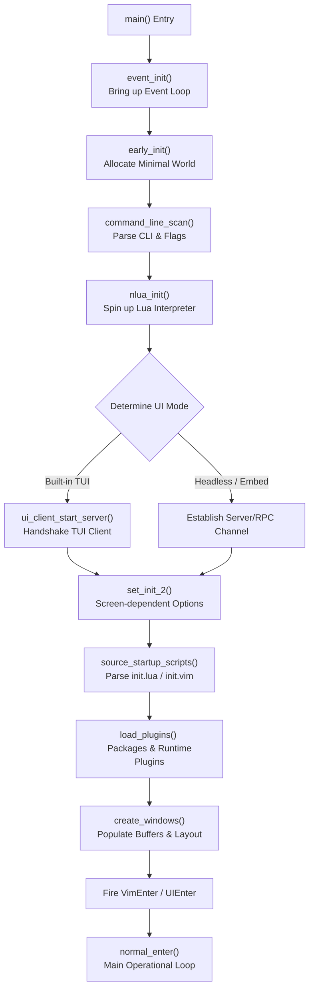

Here is the cleanly structured, beautifully formatted markdown article for the Neovim repository blueprint and startup flow.

# Neovim Architecture Blueprint: Repository Structure & Startup Flow

**Date:** May 12, 2026

**Target Audience:** Core Contributors, Plugin Developers, and Engine Engineers

## Introduction & Scope

This guide serves as a comprehensive map for developers looking to navigate the Neovim source code, understand its internal execution flow, or safely implement core changes. By walking through the repository structure, tracing the sequence from process launch to the first rendered user interface, and breaking down subsystem boundaries, this document eliminates the initial friction of onboarding onto the Neovim codebase.

### What This Guide Covers

- **Repository Layout:** A definitive breakdown of directory responsibilities and file categorization.
    
- **Control Flow Architecture:** Subsystem-level intercommunication maps.
    
- **The Startup Pipeline:** A granular, step-by-step trace of `src/nvim/main.c`.
    
- **Subsystem Deep Dives:** Domain-specific checklists, entry points, and testing strategies.
    

## 1. Repository Structure (Folder-by-Folder)

Neovim splits its codebase between a highly optimized C engine, an embedded Lua core, code-generation tooling, and legacy runtime files.

### Build & Tooling Directories

- **`cmake/`** — Core CMake helper modules and configuration scripts.
    
- **`cmake.config/`** — Global definitions and feature toggles used during compilation.
    
- **`cmake.deps/`** — A subproject dedicated to fetching, compiling, and pinning external dependencies (e.g., `libuv`, `luajit`, `msgpack`).
    
- **`cmake.packaging/`** — Automation tools for generating cross-platform release artifacts.
    
- **`deps/`** — Native dependency manifests and patches consumed by the build system.
    
- **`scripts/`** — Maintainer and CI scripts handling everything from linting and formatting to parsing `*.in.h` files for automatic binding generation.
    

### The Runtime Directory (`runtime/`)

The `runtime/` folder contains user-facing logic, native defaults, and libraries shipped alongside the editor executable. It follows a strict hierarchical layering:

|**Path**|**Visibility**|**Purpose**|
|---|---|---|
|`runtime/doc/`|Public|The canonical source for help docs (`:help`).|
|`runtime/lua/vim/`|Public|User-facing Lua standard library (`vim.lsp`, `vim.treesitter`, etc.).|
|`runtime/lua/vim/_core/`|Internal|Low-level Lua modules compiled into the binary or run during early boot.|
|`runtime/plugin/`|Public|Opt-out global plugins loaded on startup by default.|
|`runtime/pack/`|Public|Opt-in packages managed via native package paths (`:packadd`).|
|`runtime/ftplugin/`, `indent/`, `syntax/`|Public|Filetype-specific overrides, layout rules, and regex match engines.|
|`runtime/queries/`|Public|Tree-sitter query files for semantic highlight, injection, and folds.|

### Source & Test Suites

- **`src/`** — The native engine core. C source files live inside `src/nvim/`, while vendored code and low-level third-party utilities occupy neighbor folders.
    
- **`test/`** — Multi-layered testing framework:
    
    - `test/functional/` — End-to-end Lua integration tests driving real headless Neovim processes.
        
    - `test/unit/` — Granular C unit testing targeting isolated algorithmic state.
        
    - `test/benchmark/` — Performance regression validation tracking memory and CPU bounds.
        
- **`build/`** — _Transient Directory._ Contains compilation artifacts, objects, and auto-generated headers (`*.generated.h`). **Do not check into git.**
    

## 2. The Startup Pipeline: From Process Launch to UI

The initiation sequence inside `src/nvim/main.c` is highly sensitive to ordering. Below is the operational chronology of a Neovim process lifecycle.

Code snippet



### Phase 0: Entry Conditions & Mode Evaluation

Startup behavior mutates depending on standard input/output state and terminal parameters:

- **Default Interactive:** Engages the internal Terminal User Interface (`TUI`) if a valid TTY is present.
    
- **Headless Mode (`--headless`):** Suppresses standard display layers; optimized for automation servers.
    
- **Embedded Pipeline (`--embed`):** Binds standard input/output directly to a MessagePack-RPC interface for external GUI manipulation.
    

### Phase 1: Parameter Initialization (`main`)

- Validates ecosystem variables like `$NVIM_APPNAME` to isolate directory paths.
    
- Allocates the startup parameter ledger structure `mparm_T params` to bridge state parameters across compilation units.
    
- Pinpoints short-circuit arguments like `--clean` to cleanly bypass system configurations.
    

### Phase 2: Kernel Bootstrapping (`event_init`)

- Instantiates the foundational event engine loop (`main_loop`) backed by `libuv`.
    
- Configures environment primitives via `env_init()`, initializes asynchronous signal traps, and registers core communication channels.
    
- _Note:_ Beyond this point, all operations assume the existence of an active event scheduling pipeline.
    

### Phase 3: Establishing the Minimal Editor World (`early_init`)

- Maps global internal evaluation tables (`eval_init()`) and prepares standard commands via `init_normal_cmds()`.
    
- Generates execution runtime tracking patterns via `runtime_init()` and `init_path()`.
    
- Allocates the initial base editor view topology (the initial Tabpage, Window, and Buffer) using `win_alloc_first()`.
    

### Phase 4: Command-Line Interface Scanning & Lua Setup

- Resolves flags via `command_line_scan(&params)`, expanding active lists and populating arguments.
    
- Invokes `nlua_init()`, initializing the LuaJIT environment and injecting the base `vim` globally accessible object namespace.
    

### Phase 5: UI Selection & Grid Matrix Allocation

- If interactive, fires up the native terminal interface using `ui_client_start_server()` and passes processing ownership over to `ui_client_run()`.
    
- Invokes `win_init_size()` and `default_grid_alloc()` to build layout parameters.
    
- Executes `set_init_2(headless_mode)` to initialize variables dependent on physical grid properties.
    

### Phase 6: Script Discovery & Evaluation Sourcing

- **`exe_pre_commands(&params)`:** Iterates and executes all early command parameters specified via `--cmd`.
    
- **Filetype Initialization:** Runs `filetype_plugin_enable()` to build structural hooks prior to staging user files.
    
- **`source_startup_scripts(&params)`:** Searches for and runs user definitions, reading `init.lua` or `init.vim`.
    
- **Post-script Verification:** Validates state triggers via `filetype_maybe_enable()` and `syn_maybe_enable()`.
    

### Phase 7: Package Assembly & Operational Loop Entry

- **`load_plugins()`:** Sources runtime plugins and system packages (`pack/*/start`).
    
- **`create_windows(&params)`:** Allocates windows for targets explicitly requested via the CLI.
    
- **`exe_commands(&params)`:** Evaluates final script hooks (`+cmd`, `-c`, or `-S`).
    
- **Main Loop Entry:** Issues `EVENT_VIMENTER` and `UIEnter` events, then hooks execution into `normal_enter()`.
    

## 3. Subsystem Blueprints

### UI & Redraw Engine

Manages screen real-estate allocation, multi-grid composition, float translations, and drawing operations.

- **Key Entry Points:**
    
    - `src/nvim/ui.c` — Global dispatch handling, layout bindings, and drawing invalidations.
        
    - `src/nvim/ui_compositor.c` — Multi-layered floating window stacking calculations.
        
    - `src/nvim/drawscreen.c` — Screen state invalidation rendering steps.
        
    - `src/nvim/tui/tui.c` — Emitted message processing translation into ANSI terminal sequences.
        

> ### 🛠️ UI Contribution Checklist
> 
> - [ ] Classify if the defect is structural invalidation (state missing a screen flush) or rendering translation (erroneous TUI mapping).
>     
> - [ ] Keep structural drawing signatures immutable; external client architectures rely strictly on event specifications.
>     
> - [ ] Validate multi-grid layout handling if altering coordinate calculation layers.
>     

### API & Msgpack-RPC Integration

Exposes Neovim serialization primitives over network, process, or local pipes.

- **Key Entry Points:**
    
    - `src/nvim/api/` — Domain APIs (`buffer.c`, `window.c`, `vim.c`).
        
    - `src/nvim/msgpack_rpc/channel.c` — Multiplexing input/output channels across file descriptors.
        
    - `src/nvim/msgpack_rpc/server.c` — Connection dispatching tracking `--listen` routines.
        

> ### 🛠️ API Contribution Checklist
> 
> - [ ] Treat all API signatures as long-term stable; ensure additions do not alter backward compatibility layers.
>     
> - [ ] Wrap native runtime exceptions inside an explicit `Error` container instance.
>     
> - [ ] Update cross-compilation data mapping arrays if altering definition headers (`*.in.h`).
>     

### Lua Runtime Layer

Controls the execution space of the integrated LuaJIT interpreter and C type marshaling.

- **Key Entry Points:**
    
    - `src/nvim/lua/executor.c` — Memory runtime initializations and code compilation pathways.
        
    - `src/nvim/lua/converter.c` — Translating values between Lua tables and C `typval_T` data types.
        
    - `runtime/lua/vim/_core/defaults.lua` — Native system variables and configurations written directly in Lua.
        

> ### 🛠️ Lua Contribution Checklist
> 
> - [ ] Place internal, bootstrap-essential functions within `_core/`, and public utility features inside `runtime/lua/vim/`.
>     
> - [ ] Guard against multithreading conflicts; the underlying editor state is inherently bound to the main thread.
>     
> - [ ] Ensure memory leaks are avoided during type conversion sequences by cleanly calling `tv_clear()`.
>     

### Vimscript Engine (`eval`) & Ex Commands

Processes legacy languages, custom runtime scripts, variables, and procedural command invocations.

- **Key Entry Points:**
    
    - `src/nvim/eval.c` — Variable scopes, evaluation stacks, and mathematical tracking routines.
        
    - `src/nvim/eval/funcs.c` — Internal global engine function declarations (`map()`, `extend()`).
        
    - `src/nvim/ex_docmd.c` — High-level string parsing for standard colon commands (`:edit`, `:write`).
        

> ### 🛠️ Vimscript Contribution Checklist
> 
> - [ ] Retain legacy Vim behaviors unless handling explicitly approved breaking-change features.
>     
> - [ ] Be mindful of unintended side effects: evaluate hooks running inside sandbox constraints carefully.
>     
> - [ ] Test recursive structures safely to prevent overflowing the internal execution evaluation stack.
>     

### Event Loop & OS Abstraction

Handles background processes, asynchronous timers, disk input/output loops, and operating system variations.

- **Key Entry Points:**
    
    - `src/nvim/event/loop.c` — The primary abstraction wrapper over `libuv`.
        
    - `src/nvim/event/multiqueue.c` — Prioritization mechanics dividing editor events from user input streams.
        
    - `src/nvim/os/` — Filesystem interactions, signal handling, and process management wrappers.
        

> ### 🛠️ OS/Event Contribution Checklist
> 
> - [ ] Never stall the primary running event thread; leverage non-blocking async loops or thread pools for heavy disk/network workloads.
>     
> - [ ] Ensure all allocated loops, channels, or signals are safely dismantled inside `event_teardown()`.
>     
> - [ ] Route platform-specific tasks through the `os/` directory instead of calling direct platform primitives.
>     

## 4. Common Contribution Recipes

When implementing changes inside the codebase, use these common entry points to quickly locate the relevant logic:

### Adjusting Default Options

1. Define the default state in `runtime/lua/vim/_core/options.lua`.
    
2. Map corresponding configurations inside the native file handling layers within `src/nvim/option.c`.
    

### Adding a New API Function

1. Choose the appropriate file inside `src/nvim/api/` (e.g., `buffer.c` for buffer mutations).
    
2. Write the implementation using the standard signature:
    
    C
    
    ```
    Object nvim_buf_custom_method(Buffer buffer, Error *err)
    ```
    
3. Run the generator scripts via `make` to update the autogenerated RPC glue files.
    

### Modifying Filetype Detection

1. Locate rules within the unified layout file: `runtime/filetype.lua`.
    
2. Append your matching patterns into the structure, ensuring a matching test case is included in `test/functional/core/filetype_spec.lua`.
    

## 5. Navigation & Verification Toolbox

Quick reference commands to speed up discovery across the repository:

Bash

```
# Locate where a specific symbol or function is defined
rg -n "\bvoid event_init\b" src/nvim

# Track all occurrences of a function call throughout the core
rg -n "nlua_init\(" src/nvim

# Trace sequence triggers within the startup script engine
rg -n "source_startup_scripts\|load_plugins\|create_windows" src/nvim/main.c

# Run functional integration checks targeting a specific file
make functionaltest TEST_FILE=test/functional/lua/executor_spec.lua
```

### 💡 AI-Assisted Contribution Clause
 When submitting automated or partially assisted patches, ensure code compliance validation matches repository rules. Append the tracking instruction tag to your final patch message:  `AI-assisted: Codex (per AGENTS.md)`