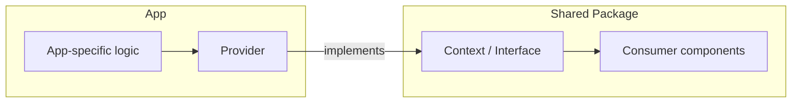

## Requirements

- What's being changed, and why?
- Related notes or prior art (link them):

## Current Coupling

- What depends on what today, concretely — a coupling, where it lives, and what happens to it:
- Verify against source; don't assume.

## Key Architecture Decisions

- D1 — decision:
  - Recommendation:
  - Rationale:
- D2 — decision:
  - Recommendation:
  - Rationale:

## Target Architecture

## Ownership After This Change

- Who/what owns which responsibility once this lands (the one-sentence rule someone could repeat later)?

## Implementation Phases (dependency-ordered)

### Phase 1

- File(s):
- Action:
- Why:
- Verify:

### Phase 2

- File(s):
- Action:
- Why:
- Verify:

## Risks

- Severity (HIGH / MEDIUM / LOW):
- Risk:
- Mitigation:

## Estimated Complexity

- Per phase:
- Total:

## Progress Log

- Date — what changed, what was decided, what's next:

## Status

- [ ] Phase 1:
- [ ] Phase 2:

## Outcome
