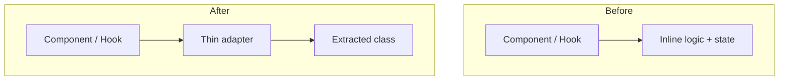

## Requirements

- What's being restructured, and why?
- What must NOT change (the behavior/output to preserve)?
- Related notes or prior art (link them):

## Current Behavior

- Key observations about what the code actually does today — verified against source, not assumed:

## Before → After

- What stays exactly the same (name the files/behaviors that don't change):

## Implementation Phases

### Phase 1

- File(s):
- Action:
- Why:
- Verify equivalence (grep / test / visual diff):

### Phase 2

- File(s):
- Action:
- Why:
- Verify equivalence (grep / test / visual diff):

## Risks

- Severity (HIGH / MEDIUM / LOW):
- Regression risk:
- Mitigation:

## Estimated Complexity

- Per phase:
- Total:

## Status

- [ ] Phase 1:
- [ ] Phase 2:

## Outcome

- Deviations from the plan (small issues often surface mid-refactor — note them here):
